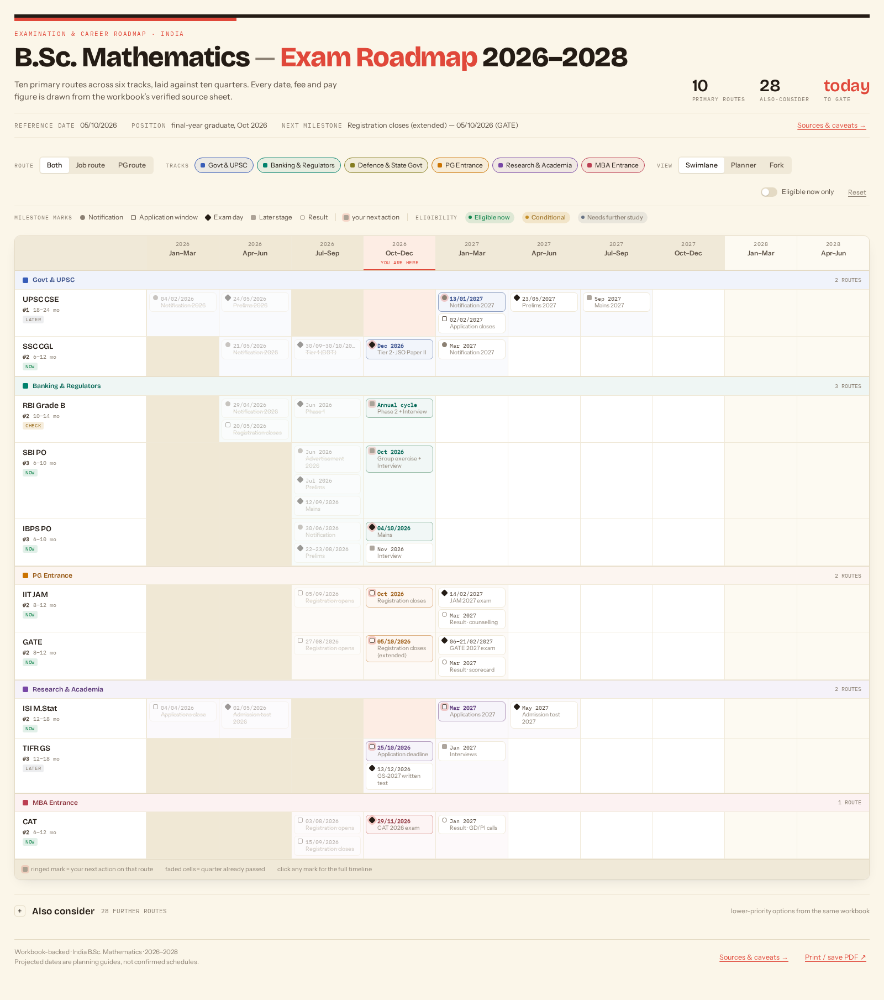
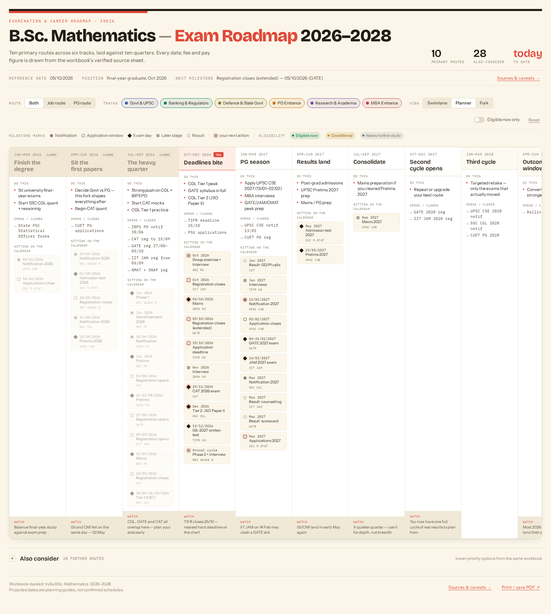
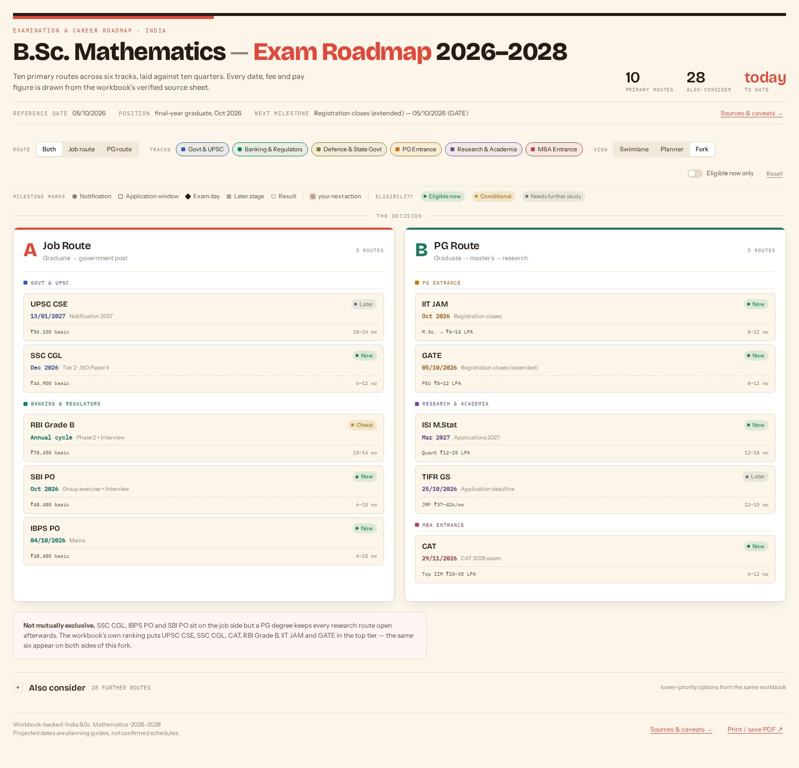

<a id="top"></a>

<div align="center">

# 🎓 B.Sc. Mathematics<br>Exam Roadmap 2026–2028

### One roadmap. Three perspectives. Your next move.

An interactive examination and career timeline for **B.Sc. Mathematics graduates in India** — compare opportunities, spot overlapping exam windows, and plan what to prepare for next.


**[📸 Preview](#-website-preview)** · **[✨ Features](#-features)** · **[🚀 Quick start](#-quick-start)** · **[📚 Sources](#-data--sources)**

Built for and maintained in **[ALGOGUY09's repository](https://github.com/ALGOGUY09/B.Sc.-Mathematics-Exam-Roadmap-2026-2028)**.

</div>

---

## 📸 Website preview



*Actual website screenshot captured on **5 October 2026**, at a 1600px desktop width. The additional-route section is collapsed to keep the focus on the main timeline. The current-quarter marker and countdown change with the real date.*

<details>
<summary><strong>🗓️ See the quarterly Planner view</strong></summary>



The Planner keeps the ten-quarter axis intact. Scroll horizontally to explore later quarters on narrower screens.

</details>

<details>
<summary><strong>🧭 See the Job vs PG Fork view</strong></summary>



Compare graduate job opportunities with postgraduate and research paths side by side.

</details>

> 🌐 **Hosting status:** The project is uploaded to GitHub, but **not deployed to production**. A GitHub repository URL is a code page, not the running website. The temporary [sandbox preview](https://3000-imi0l4aal6pdv7ilpl4nw-b237eb32.sandbox.novita.ai) is available only while the development environment is active. The screenshots above remain available in the repository even when that preview expires.

## 💡 Why this roadmap?

A mathematics graduate can pursue government services, banking, postgraduate study, research, management, and other specialist paths. A flat list makes it hard to see **when applications overlap**, **which eligibility rules need attention**, and **what to do next**.

This project brings the same dataset into three complementary views:

| View | What it shows | Best for |
| :--- | :--- | :--- |
| 🏊 **Swimlane** | Examination rows against a quarter-by-quarter timeline | Spotting overlapping windows and following each exam cycle |
| 🗓️ **Planner** | Quarterly actions, application windows, and exam milestones | Turning the roadmap into a preparation plan |
| 🧭 **Fork** | Job and postgraduate routes side by side | Comparing career directions and next actions |

### At a glance

| 🎯 Primary routes | 🔎 Additional options | 🎨 Career tracks | 📅 Timeline |
| :---: | :---: | :---: | :---: |
| **10** | **28** | **6** | **10 quarters** |

**Coverage:** January 2026 → June 2028.

**Primary exams:** UPSC CSE · SSC CGL · RBI Grade B · SBI PO · IBPS PO · IIT JAM · GATE · CAT · ISI M.Stat · TIFR GS.

**Tracks:** Government & UPSC · Banking & Regulators · Defence & State Government · PG Entrance · Research & Academia · MBA Entrance. Some tracks appear only in the additional-route index.

## ✨ Features

### 🔍 Explore and compare
- Switch instantly between **Swimlane, Planner, and Fork** without losing your filters.
- Combine **Job / PG route**, **career-track**, and **eligibility** filters.
- Double-click a track chip to isolate that track.
- Open the **28 “Also consider” routes** without cluttering the main chart.
- Use **Reset** to return to the full dataset; empty states explain when no routes match.

### 📋 Read the full picture
- Click any exam, milestone, or additional-route card to open its detail drawer.
- Explore timelines, eligibility, exam patterns, preparation time, competition, application fees, and pay figures.
- Follow official-portal links and browse the **16 reference links** in Sources & caveats.
- Distinguish **projected dates** from entries that are not marked projected in the workbook.

### 🎨 Designed to be usable
- Warm-paper **Highlighter** palette with distinct track colors and editorial typography.
- Self-hosted **Bricolage Grotesque**, **Instrument Sans**, and **IBM Plex Mono**.
- Milestone shapes, next-action rings, and hover tooltips.
- Real-date countdowns and a current-quarter marker using **Asia/Kolkata**.
- Responsive layouts with horizontally scrollable timelines on smaller screens.
- **Print / save PDF** styling designed for **A3 landscape**.
- Keyboard-focus indicators, drawer focus trapping, Escape-to-close, and restored focus.

## 🚀 Quick start

### Prerequisites

- **Node.js 22.12 or newer** to satisfy the Vite and Wrangler requirements.
- **npm**.
- **Git** to clone the repository.

No API keys, database, or Cloudflare account are required for local preview.

### 1. Clone and install

```bash
git clone https://github.com/ALGOGUY09/B.Sc.-Mathematics-Exam-Roadmap-2026-2028.git
cd B.Sc.-Mathematics-Exam-Roadmap-2026-2028
npm ci
```

### 2. Build and preview locally

```bash
npm run build
npm run dev:sandbox
```

Open **http://localhost:3000** in your browser. The preview serves the built Cloudflare Pages application through Wrangler.

> 🔄 After changing source code or static assets, run `npm run build` again to refresh the built preview.

### 3. Check the service

```bash
curl http://localhost:3000/api/health
```

Expected response:

```json
{"status":"ok","project":"exam-roadmap"}
```

<details>
<summary><strong>🛠️ Running in the Genspark sandbox with PM2</strong></summary>

The supplied PM2 configuration targets the workspace at `/home/user/webapp` and port `3000`. It is a sandbox-specific process configuration, not a portable local-machine path.

```bash
cd /home/user/webapp
npm run build
pm2 start ecosystem.config.cjs
pm2 logs webapp --nostream
```

If you reuse the PM2 configuration outside the sandbox, update its `cwd` to your actual checkout location.

</details>

## 🧑‍🎓 How to use it

1. **Choose a route:** Both, Job route, or PG route.
2. **Choose your tracks:** toggle individual chips, or double-click one to focus on it.
3. **Narrow eligibility:** enable *Eligible now only* to keep entries with the workbook's “Eligible now” flag.
4. **Pick your perspective:** use Swimlane for overlaps, Planner for preparation actions, or Fork for career comparisons.
5. **Inspect an exam:** click its name or milestone to see the full record.
6. **Verify before applying:** open the exam's official portal and check its current notification.
7. **Save a printable copy:** select *Print / save PDF* and use your browser's print dialog.

> ⚠️ The eligibility toggle is a **workbook classification**, not an assessment of your age, marks, subjects, category, or degree-completion date.

## 🧱 Technology & architecture

| Layer | Technology | Purpose |
| :--- | :--- | :--- |
| Server | **Hono + TypeScript** | Page rendering, static routing, and the health endpoint |
| Frontend | **Native JavaScript ES modules + CSS** | Views, filters, drawers, tooltips, and responsive styling |
| Build | **Vite** | Produces the Cloudflare Pages application in `dist/` |
| Edge preview | **Wrangler** | Runs the built app locally in the Cloudflare development runtime |
| Browser tests | **Playwright + Chromium** | Checks interactions, responsive layouts, fonts, and print styles |
| Sandbox process | **PM2** | Keeps the development preview running |

**Lightweight by design:** no in-browser Babel, no React CDN runtime, no external font requests, and no API credentials. User interface state stays in the current page session; there is no database or persistent user storage.

### Repository map

```text
.
├── docs/
│   └── screenshots/          # Real website screenshots used in this README
├── public/
│   └── static/
│       ├── app.js            # Views, filters, drawers, and date helpers
│       ├── roadmap-data.js   # Normalized handoff dataset as an ES module
│       ├── style.css         # Tokens, components, responsive and print styles
│       └── fonts/            # Self-hosted fonts and their license notices
├── src/
│   └── index.tsx             # Hono application and HTML entry point
├── tests/
│   └── roadmap.spec.js       # Eight browser tests
├── ecosystem.config.cjs     # Sandbox-specific PM2 configuration
├── package.json             # Scripts and dependencies
├── vite.config.ts           # Cloudflare Pages build setup
└── README.md
```

### Entry points

| Path | Purpose |
| :--- | :--- |
| `/` | Interactive exam roadmap; no query parameters required |
| `/#timeline-section` | Main timeline anchor |
| `/#also-consider` | Additional-route index anchor |
| `/api/health` | JSON health endpoint |
| `/static/*` | JavaScript, stylesheet, and self-hosted font assets |

## 🧪 Testing

Install the Chromium browser and its required system libraries once:

```bash
npx playwright install --with-deps chromium
```

With the local preview running on port `3000`:

```bash
npm test
```

The **8 browser tests** cover:
- ✅ Route counts, current-quarter positioning, and local font loading.
- ✅ Combined route, track, and eligibility filters, including Reset.
- ✅ Empty states and filter preservation across view changes.
- ✅ Primary-exam timelines, projected labels, modal focus, and Escape.
- ✅ Additional-route details, scrim closing, collapse, and sources.
- ✅ Hover tooltips and next-action rings.
- ✅ Mobile width constraints, horizontal scrolling, and drawer sizing.
- ✅ Print-only visibility rules.

Tests fix the browser clock at **4 October 2026** for repeatable assertions. The actual website uses the current India calendar date.

**Latest local verification:** 8/8 tests passed. This is a recorded local result, not an automated CI status badge.

## 📚 Data & sources

The website preserves the dataset supplied in the design handoff, derived from **`India_BSc_Maths_Career_Exams_2026-2028.xlsx`**:

- **Master Table** — exams, eligibility, patterns, fees, and career details.
- **24-Month Calendar** — examination and application windows.
- **Salary Comparison** — starting pay and longer-term pay information.
- **Success Ratios** — competition and selection statistics.
- **Verified Sources** — underlying reference links.

The browser imports quarters, tracks, primary records, secondary details, quarterly plans, eligibility labels, and source links from [`public/static/roadmap-data.js`](public/static/roadmap-data.js). The complete reference list is also available inside the website under **Sources & caveats**.

### Official portals to re-check

[UPSC](https://upsc.gov.in/) · [SSC](https://ssc.gov.in/) · [IBPS](https://www.ibps.in/) · [SBI Careers](https://sbi.bank.in/web/careers) · [RBI](https://rbi.org.in/) · [GATE 2027](https://gate2027.iitm.ac.in/) · [IIT JAM](https://jam.iitkgp.ac.in/) · [ISI Admissions](https://admission.isical.ac.in/) · [TIFR](https://www.tifr.res.in/academics/gs_advertisement.php) · [CAT](https://iimcat.ac.in/)

### ⚠️ Read before relying on the dates

- **This is a planning tool, not an official notification service.** Implementation did not independently re-research or revalidate every workbook claim.
- **Research content is a 2026 snapshot.** The calendar marker and countdown update with the real date, but examination records, eligibility flags, and preparation text do not refresh automatically.
- **Projected dates are estimates.** Verify any application or exam date on the current official portal before acting.
- **Pay labels matter.** Basic pay, in-hand estimates, gross salary, and CTC are not interchangeable or directly comparable.
- **Eligibility is personal.** Check the current rules for subjects, aggregate marks, age, relaxations, category, and degree completion.
- **Coarse dates need interpretation.** Month-only entries use the first of the month for sorting. Past-quarter shading and a 25-day grace preserve the handoff's treatment of approximate labels.

## ☁️ Deployment status

| Item | Status |
| :--- | :--- |
| 📦 Source on GitHub | Available on the `main` branch |
| 🏗️ Cloudflare Pages-compatible build | Implemented and build-tested |
| 🧪 Local browser tests | 8 tests passing at latest verification |
| 🌐 Production website | **Not deployed** |
| 🗃️ Database / storage bindings | Not required |

The complete application includes Hono server routes, so **simply enabling GitHub Pages will not run it unchanged**. Choose a Cloudflare-compatible hosting path for the full application: either Genspark-managed hosting or your own Cloudflare account.

Uploading code or editing this README does **not** deploy the website.

## 🛣️ Next steps

- [ ] Re-check historical workbook dates and eligibility against current official notifications.
- [ ] Deploy through the selected Cloudflare hosting path and add the permanent live URL here.
- [ ] Add CI to run builds and browser tests automatically.
- [ ] Consider saved shortlists and reminder integrations if persistent user features are needed.

**Not implemented:** accounts, saved selections, reminders, automated notification refresh, or runtime design tweaks. These are future possibilities, not currently working features.

## 🤝 Contributing

Have a correction or improvement? **[Open an issue](https://github.com/ALGOGUY09/B.Sc.-Mathematics-Exam-Roadmap-2026-2028/issues)** or submit a pull request. For examination data corrections, include the official notification URL and clearly distinguish confirmed dates from projections.

Font license notices are bundled in [`public/static/fonts/`](public/static/fonts/). No repository-wide software license is declared at this time.

---

<div align="center">

**🎓 Plan with clarity. Verify with official sources. Prepare with purpose.**

[Back to top ↑](#top)

</div>
